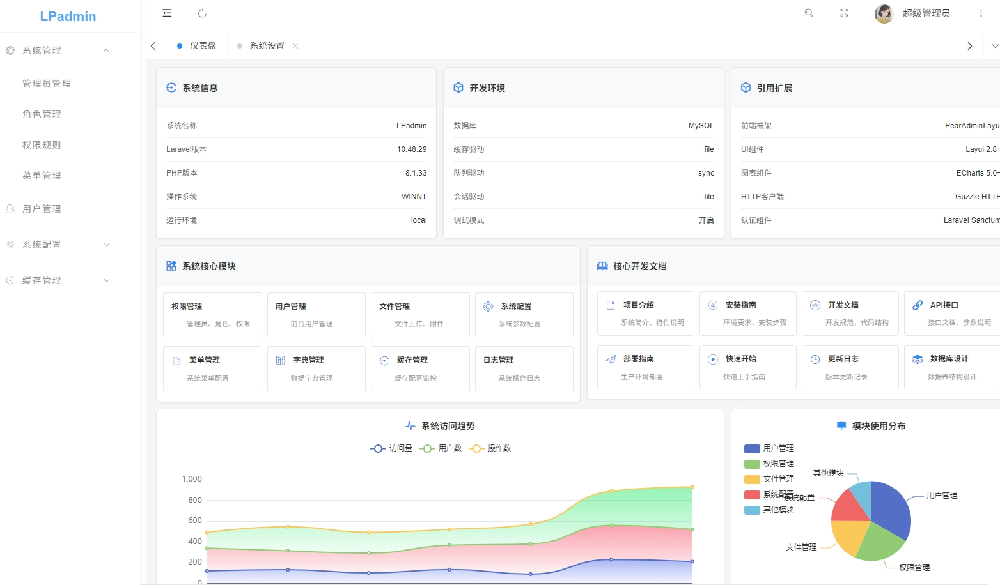
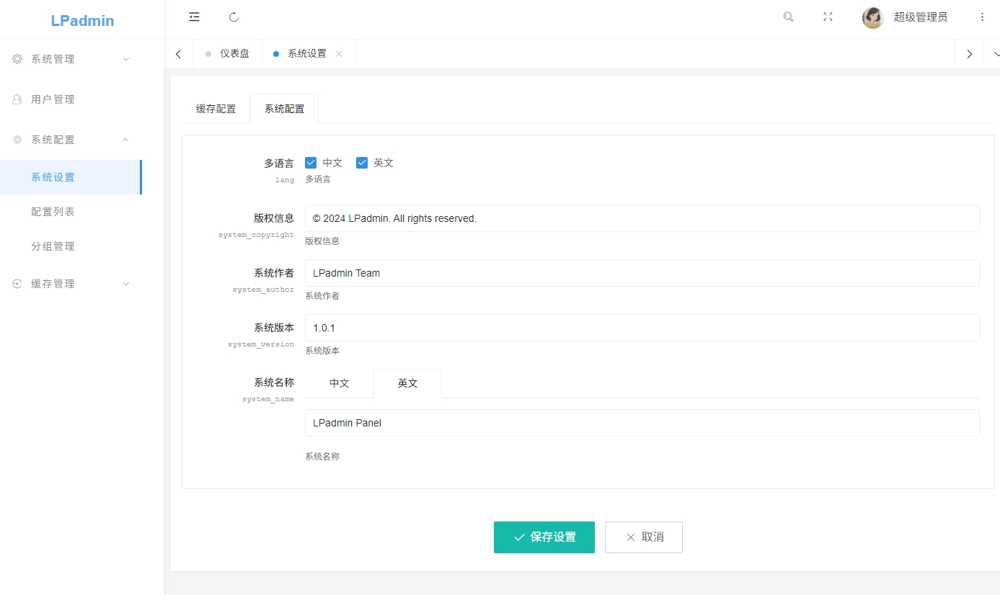

# LPadmin - Laravel Admin Management System

## 🚀 Introduction

LPadmin is a modern admin management system developed based on Laravel 10 + PearAdmin Layui framework, supporting frontend multi-language configuration, providing complete RBAC permission management, user management, system configuration and other features.

- **Development Example**
  Lpadmin Multi-language Blog System: https://github.com/zhoukou2021/Lpadmin-Blog

- **Demo Preview**
   

## ✨ Features

- 🚀 **High Performance**: Based on Laravel 10+, excellent performance and fast response
- 🎨 **Beautiful Interface**: PearAdminLayui UI, beautiful interface with excellent user experience
- 🔐 **Permission System**: Complete RBAC permission system, supporting fine-grained role and permission management
- 📱 **Responsive Design**: Supports PC, tablet, mobile and other multi-device access
- 🔧 **Highly Configurable**: Supports dynamic route configuration, flexible system parameter adjustment
- 📊 **Data Statistics**: Rich data statistics and chart display functions
- 🛡️ **Secure & Reliable**: Multi-layer security protection, complete operation log recording
- 🔌 **Easy to Extend**: Modular design, supports plugin development

## 📋 Feature Modules

### Core Features
- **Dashboard**: System overview, data statistics, quick operations
- **Permission Management**: Admin management, role management, menu permission management
- **User Management**: Frontend user management, user status control
- **System Management**: System configuration, dictionary management, operation logs
- **File Management**: File upload, attachment management, storage configuration

### Development Tools
- **Database Management**: Data table viewing, structure analysis
- **Form Builder**: Visual form designer
- **Code Generator**: Automatic CRUD code generation
- **Component Development**: Example component: System Log
- **API Documentation**: Online API documentation viewing

## 🛠️ Tech Stack

- **Backend Framework**: Laravel 10+
- **Frontend Framework**: PearAdminLayui
- **Database**: MySQL 8.0+
- **Cache**: Redis (Optional)
- **Queue**: Laravel Queue
- **Search**: Laravel Scout (Optional)

## 🚀 Quick Start

### Requirements

- PHP >= 8.1
- Laravel >= 10.0
- MySQL >= 8.0
- Composer
- Node.js & NPM

### Installation Steps

1. **Clone the repository**
```bash
git clone https://github.com/zhoukou2021/lpadmin.git
cd lpadmin
```

2. **Environment Configuration**
```bash
cp .env.example .env
php artisan key:generate
```

3. **Database Configuration**
```bash
Edit .env file to configure database
php artisan migrate --seed
```

4. **Set Document Root**

Set `public` as the document root directory.

5. **Set URL Rewriting**
```bash
location / {
    try_files $uri $uri/ /index.php?$query_string;
}
```

Visit `http://localhost:8000/lpadmin` to access the admin management system. Default credentials: `admin/123456`.

Demo: http://lpadmin.code120.cn

## 📖 Version Information

- **Current Version**: v1.0.0
- **Laravel Version**: 10.x
- **PHP Version**: 8.1+
- **Release Date**: 2025-01-01

## 🤝 Contributing

We welcome submitting Issues and Pull Requests to help improve LPadmin.

### Code Standards
- Follow PSR-12 coding standards
- Use Laravel best practices
- Write unit tests
- Update relevant documentation

## 📄 License

This project is licensed under the [MIT License].

## 🙏 Acknowledgments

Thanks to the following open source projects for their support:
- [Laravel](https://laravel.com/) - The elegant PHP framework
- [PearAdminLayui](https://github.com/pearadmin/pear-admin-layui) - Excellent admin UI framework
- [Layui](https://layui.dev/) - Classic frontend UI framework

## 📞 Contact Us

- Project Homepage: https://gitee.com/xw54/lpadmin
- Issue Tracker: https://gitee.com/xw54/lpadmin/issues
- Email: jiu-men@qq.com

---

<div align="center">
  <p>Made with ❤️ by LPadmin Team</p>
  <p>Copyright © 2024 LPadmin. All rights reserved.</p>
</div>

